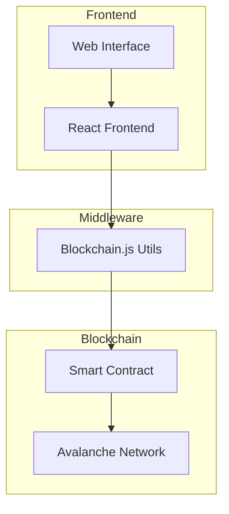
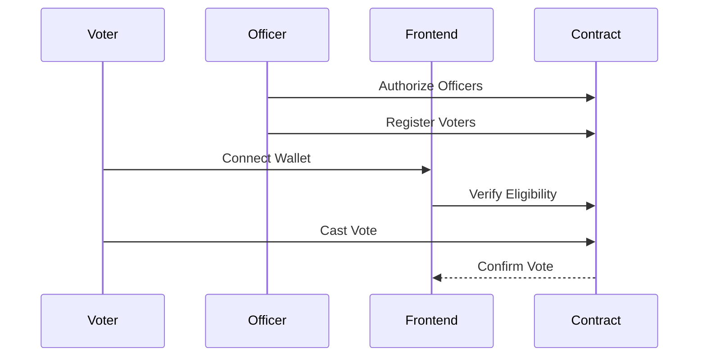

<<<<<<< HEAD
# Blockchain-Based Voting System

A secure and transparent decentralized voting system built on blockchain technology, featuring a modern UI with glassmorphic effects and real-time animations.

## 🌟 Features

- **Secure Blockchain Voting**: Immutable and transparent vote recording
- **Role-Based Access Control**: Dedicated interfaces for voters and polling officers
- **Real-time Updates**: Instant vote confirmation and status updates
- **Modern UI/UX**: Glassmorphic design with particle animations
- **Smart Contract Security**: Robust validation and access control

## 🏗 Architecture



## 🔧 Technology Stack

- **Frontend**: React + Vite
- **UI Framework**: Chakra UI
- **Animations**: Anime.js + React Particles
- **Blockchain**: Solidity + Ethers.js
- **Network**: Avalanche Fuji Testnet

## 🚀 Getting Started

1. Clone the repository:
   ```bash
   git clone https://github.com/NIHAL-PM/blockchainbasedvotingsystem.git
   cd blockchainbasedvotingsystem
   ```

2. Install dependencies:
   ```bash
   npm install
   ```

3. Configure environment variables:
   Create a `.env` file with:
   ```env
   PRIVATE_KEY=your_private_key
   VITE_CONTRACT_ADDRESS=your_contract_address
   ```

4. Run the development server:
   ```bash
   npm run dev
   ```

## 🔄 Workflow



## 📦 Smart Contract Structure

```solidity
// Key components of OnChainRegistry.sol
contract OnChainRegistry {
    mapping(address => bool) public pollingOfficers;
    mapping(bytes32 => VoterInfo) public voterRegistry;
    mapping(uint256 => mapping(uint256 => uint256)) public voteCounts;
    
    struct VoterInfo {
        string name;
        uint256 constituencyId;
        bool hasVoted;
        bool isRegistered;
    }
}
```

## 🔐 Security Features

- **Role-Based Access**: Only authorized officers can register voters
- **One-Time Voting**: Each voter can only vote once
- **Cryptographic Security**: Voter IDs are hashed for privacy
- **Smart Contract Guards**: Modifiers prevent unauthorized access

## 🎨 UI/UX Features

- Glassmorphic card components with dynamic lighting effects
- Interactive particle background animations
- Smooth state transitions and loading states
- Responsive design for all device sizes

## 🛠 Development Commands

```bash
# Start development server
npm run dev

# Build for production
npm run build

# Deploy smart contract
npm run deploy
```

## 🤝 Contributing

Contributions are welcome! Please feel free to submit a Pull Request.

## 📄 License

This project is licensed under the MIT License - see the [LICENSE](LICENSE) file for details.

## 🙏 Acknowledgments

- Avalanche Network for the blockchain infrastructure
- OpenZeppelin for smart contract security patterns
- Chakra UI for the component library
